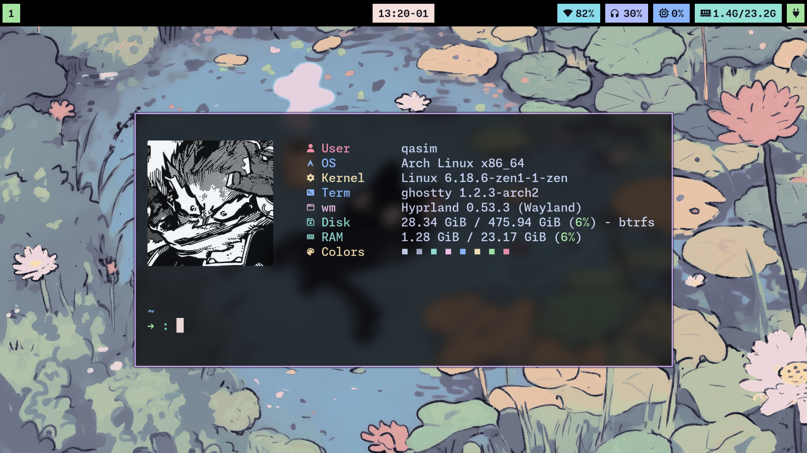
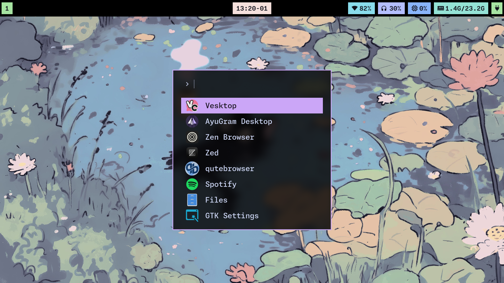
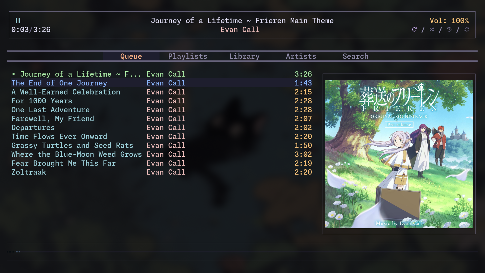
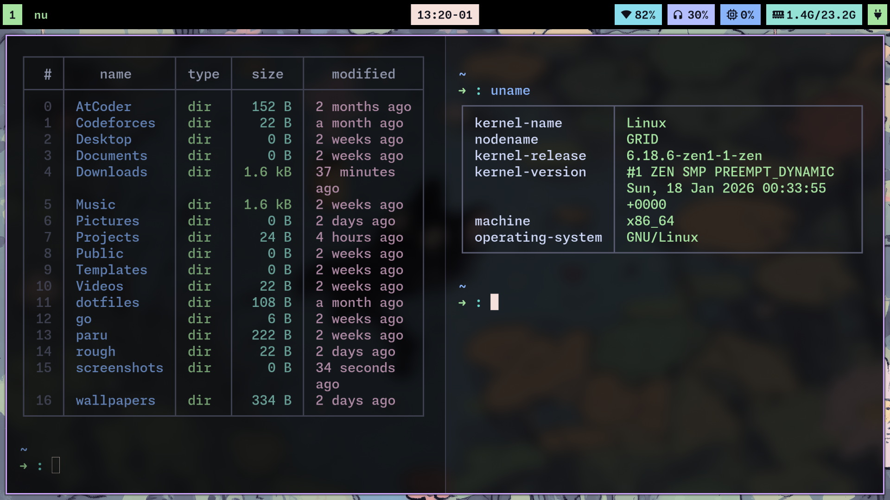
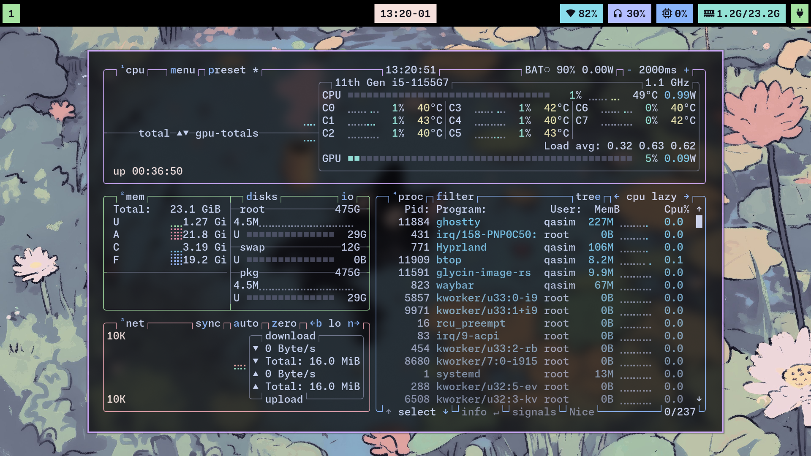
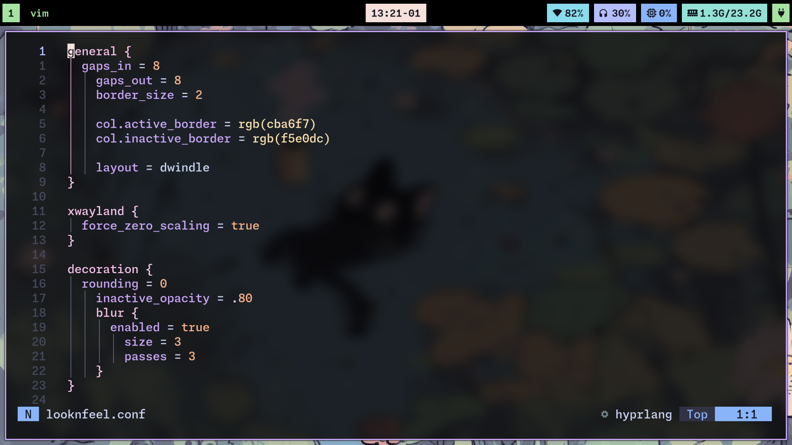

# Dotfiles

<p align="center">
  
</p>

## Preview

<table align="center">
  <tr>
    <td></td>
    <td></td>
    <td></td>
  </tr>
  <tr>
    <td></td>
    <td></td>
    <td></td>
  </tr>
</table>

## Stack

| Component | Application |
|-----------|-------------|
| **WM** | Hyprland |
| **Terminal** | Ghostty |
| **Shell** | Nushell|
| **Bar** | Waybar |
| **Launcher** | Fuzzel |
| **Editor** | Neovim|
| **File Manager** | Joshuto |
| **Music** | rmpc + mpd + mpd-discord-rpc |
| **System Monitor** | btop |
| **Theme** | Catppuccin Mocha (High Contrast)|

## Installation

```bash
# 1. Clone and run install script
git clone ssh://git@codeberg.org/qasimsk20/dotfiles.git ~/dotfiles
cd ~/dotfiles
./install.sh

# 2. System configs (requires sudo)
sudo ./system-setup.sh

# 3. Reboot
reboot
```

## Overview

- **Hyprland** No Animations and Minimal config
- **Ghostty** Catppuccin High Contrast and custom keybinds that immitate tmux prefix for ghostty-tabs
- **Waybar** Inspired by [ThePrimeagen](https://github.com/ThePrimeagen) and [typecraft-dev](https://github.com/typecraft-dev)
- **RMPC(mpd)** configured on top of [Sin-cy rmpc and mpd dotfiles](https://github.com/Sin-cy/dotfiles/tree/main/rmpc/.config/rmpc) along with mpc-discord-rpc
- **Nushell** native completions except carapace for git cargo etc.
- **Neovim** also inspired by [ThePrimeagen](https://github.com/ThePrimeagen) and [typecraft-dev](https://github.com/typecraft-dev)
- **Fuzzel** basic menu + cliphist 
- **Systemd user services** Hyprland with uswm so all autostart services are systemd managed
- **SDDM and TTY theming** with catppuccin high contrast

## System Requirements

- Arch Linux
- yay/paru
- systemd-boot

## Credits

- [Catppuccin](https://github.com/catppuccin/catppuccin)
- [typecraft-dev](https://github.com/typecraft-dev)
- [ThePrimeagen](https://github.com/ThePrimeagen)
- [Sin-cy](https://github.com/Sin-cy/dotfiles/tree/main/rmpc/.config/rmpc)
